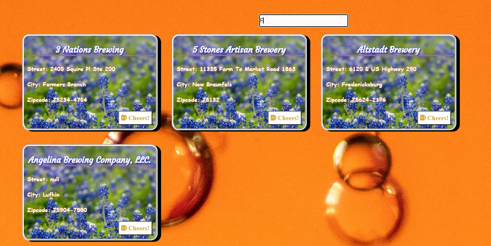

# Texas-BrewFinder
Texas BrewFinder is a web application that allows users to search for breweries in Texas by location via data fetched from the *Open Brewery DB* API. 

## About
Per the Open Brewery DB wesbite, Open Brewery DB is "a free dataset and API with public information on breweries, cideries, brewpubs, and bottleshops". The database provides the name, location, and additional information such as brewery "type" (e.g. micro, large, etc.) for each facility listed, however the data set is incomplete for some facilities. Texas BrewFinder uses this database to provide the location data for each facility, allowing the user to search for breweries in a specified city in Texas. For those planning to tour breweries/cideries/brewpubs/bottleshops around Texas, this is the app for you.
Link: [Open Brewery DB](https://www.openbrewerydb.org/)

## How It Works
Using Texas BrewFinder is easy: simply enter the name of a Texas city in the search field. 

***
A card displaying a name and address is then generated for each facility with a matching location. 

***

## License

**MIT**

